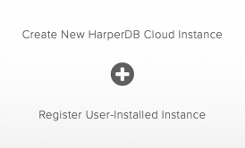
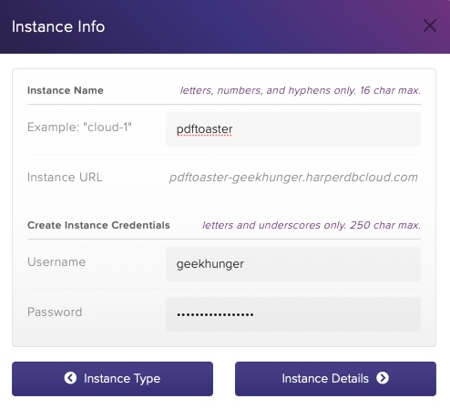
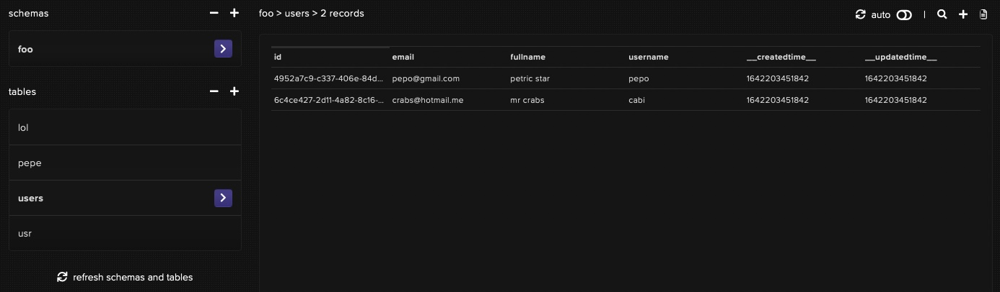
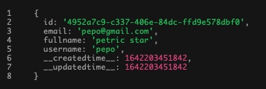
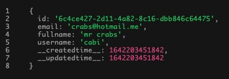
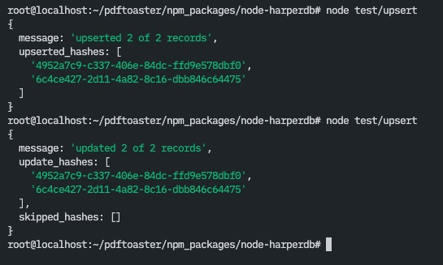
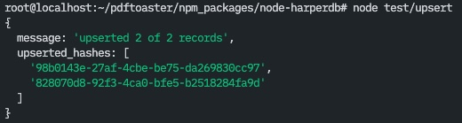
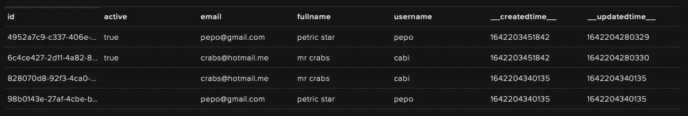

# node-harperdb

> **One word of warning:** I use this package for some of my personal projects and therefore I may introduce breaking changes in future updates (or maybe not 🤗 ). If you plan to use this package in production, you should better fork the Git repo and maintain it yourself!

## Why?

[HarperDB](https://harperdb.io) is a distributed realtime JSON cloud database. It's highly scalable, has low-latency, has dynamic schemas and it's super easy to use and maintain. There are even build-in cloud functions, loadbalancing and other great goodies! Their free tier service plan is certainly capable of running decent applications too. But, their [HTTP API](https://api.harperdb.io) could use some extra love 😘...

<p align="center"></p>

## TL;DR

```shell
npm i node-harperdb
```
```js
const {database, mount, run} = require("node-harperdb")
```

> **NOTE:** `db.pipe()` is the only function that is synchronous. Every other class method returns a Promise!

### Public class properties
- `db.instance`
- `db.auth`
- `db.schema`
- `db.table`
- `db.primary_key`

#### Private class properties
- `db.schema_undefined`
- `db.table_undefined`
- `db.pipeline`

### Public class methods
- [`db.pipe(request, ...params)`](#db-pipe)
- [`db.drain()`](#db-drain)
- [`db.run(query)`](#db-run)
- [`db.insert(records)`](#db-insert)
- [`db.update(records)`](#db-update)
- [`db.upsert(records)`](#db-upsert)
- [`db.delete(uid)`](#db-delete)
- [`db.uid(filter)`](#db-uid)
- [`db.select(filter)`](#db-select)

#### Private class methods
- [`db.request(query)`](#db-request)

<br>

```js
!async function() {
    const db = database(
        "https://foobar-geekhunger.harperdbcloud.com", // Instance-URL
        "aGFsbG86Z2Vla2h1bmdlcg==" // Basic-Auth Base64 token
        "production", // db schema (alias namespace)
        "users" // db table
    )

    await db.insert([
        {email: "first@user.at"},
        {email: "second@user.to"}
    ])

    const users = await db.select()

    console.log(users)
}()
```


<br>
<br>

## Preparations

First, visit [HarperDB Studio](https://studio.harperdb.io) and create your free account (or sign in if you already have one).

Create a new Organization and a new HarperDB Cloud Instance within it. - The Cloud Instance is sort of your VPS that is hosting your installation of HarperDB. You can have one for free, with fixed specs; additional Instances need to be paid separately.

<div>
    
    
</div>

<div>
    
    
</div>

Once you have your Instance (it takes a moment), switch to the 'config' tab and grab your Instance-URL and Basic-Auth token.

Now, go back to your project and install this package from NPM: `npm i node-harperdb`


<br>
<br>

## Connect to your HarperDB (Cloud) Instance

`require("node-harperdb")` returns an object with three functions `{database, mount, run}`. You don't have to use all of them, but you'll need at least `{database}` constructor.

Use `database(instance, auth [,schema] [,table])` to connect to your HarperDB Cloud Instance. Use the credentials obtained in ['Preparations'](#preparations) step.

```js
const {database} = require("node-harperdb")
const db = database("https://foobar-geekhunger.harperdbcloud.com", "aGFsbG86Z2Vla2h1bmdlcg==")
```

> The constructor does not actually 'connect' to a server via sockets or something... not immediately at least. It simply stores your credentials inside `db.instance` (URL) and `db.auth` (Basic-Auth token) properties and uses those values in the HTTP requests that it makes to HarperDB HTTP API. You can swap out credendials, schema or table at any time, without worrying about opening or closing any connections, because there is really no connection until you fire your request.

The return value of the constructor is a handle to the class instance (of the underlaying HarperDB class), on which you call methods like insert, update, select and so on. (See the [list of available class methods](#class-methods) below, for detailed information on each method.)

- When calling `database(instance, auth, schema, table)` **with arguments**, then `instance` and `auth` arguments become mandatory! But `schema` and `table` remain always optional.

- When calling `database()` **without arguments** then you get back the handle of the currently 'connected' HarperDB Instance. (It throws an error if you have not yet connected.)

```js
const {database, mount, run} = require("node-harperdb")

database() // NOT OK: Cannot fetch db handle because of missing credentials!

database("https://foobar-geekhunger.harperdbcloud.com", "aGFsbG86Z2Vla2h1bmdlcg==") // connect to your Cloud Instance

let db = database() // OK: Returns a handle to the current db connection. Use it to execute requests on the database.
```

Once connected, you can switch the schema and table at any time *(without passing your credentials each time)*. To swap schema and/or table simply use `mount(schema, table)` which is really a shortcut to `database(undefined, undefined, schema, table)`!

```js
const {database, mount} = require("node-harperdb")

database(
    "https://foobar-geekhunger.harperdbcloud.com", // your HarperDB Instance
    "aGFsbG86Z2Vla2h1bmdlcg==", // your HarperDB Basic-Auth token
    "mvp", // your HarperDB schema (alias namespace)
    "users" // your HarperDB table
)

database().insert({...}) // do something here...

mount("prod", "users") // swap the namespace and/or table

database().insert({...}) // do something there...
```


<br>
<br>

## Class methods


- <h3 id="db-request"><code>db.request(query)</code></h3>

Fundamentally, a [`needle`](https://www.npmjs.com/package/needle) 'POST' request handler. It sets required request headers, converts the `query` payload input into JSON and sends-off the HTTP request to the HarperDB HTTP API. The response from the API is then parsed into JSON and returned back as a JS object. So, JS-in and JS-out.

The `query` argument can be passed as an Object, an Array of Objects, or as a String. - Normally, you simply pass a JS object that looks exactly as you want it to be saved in the database. One Object equals one db entry. An array of Objects means multiple database entries. Strings are handy for SQLite queries! (Yes, HarperDB has you covered, my friend!)

Objects would be a so called [NoSQL request](https://api.harperdb.io/#257368f1-2c13-433f-bf99-b650d7421c77) in HarperDB. A NoSQL request has a descrete JSON structure that you need to maintain in order to get a successful response back from HarperDB Web API.

Luckily, you don't have to worry about that, because `db.request` does the conversion automatically! But here's an example anyways...

```js
// run a NoSQL operation
const response = db.request({
    "operation": "delete",
    "schema": "dev",
    "table": "dog",
    "hash_values": [1]
})
```
```js
// run a SQLite query
const response = await db.request({
    "operation": "sql",
    "sql": "SELECT * FROM dev.dog WHERE id = 1"
})
```

This is were Strings come in... If `query` argument is a String then it will be interpreted as a [raw SQL statements](https://harperdb.io/docs/sql-overview)! (*Yes,* you have the **full power of SQLite** at your desposal!) `db.request` will wrap the string into an object (as shown in previous example) and send if off.

```js
// here's the exact same SQLite query but simpler...
const response = await db.request("SELECT * FROM dev.dog WHERE id = 1")
console.log(response)
```

If you plan on building your own request for some reason, then refer to the official [HarperDB API documentation](https://api.harperdb.io). ([If you want to dig deeper, I suggest you lookup topics on SQLite and JSONata.](https://harperdb.io/docs/sql-overview/sql-json-search))

```js
// Here's a raw HarperDB NoSQL operation. This example is taken 1:1 from HarperDB docs!
db.request({
    "operation": "search_by_hash",
    "schema": "dev",
    "table": "dog",
    "hash_values": [
        1,
        2
    ],
    "get_attributes": [
        "dog_name",
        "breed_id"
    ]
})
.catch(console.error)
.then(console.log)
```


<br>

- <h3 id="db-run"><code>db.run(query)</code></h3>

Very similar to `db.request` but with one key difference: **It prepares the database table before running queries on it!** - For example, if you were to execute `db.insert()` on a missing schema and/or table, then this function would 🪄automagically create them *and then* run your request on it.

> Obviously, the schema and table would *not* be created just yet, if it's a read request, like 'search_by_conditions'. Namespaces are only auto-created on write operations like 'insert'.

```js
mount("foo.bar") // db.schema = "foo"; db.table = "bar";
try {
    console.log(await database().select({username: "foobar"})) // will not create table "bar" because it's a read request
    console.log(await database().upsert({username: "foobar"})) // will create table "bar" and write a new record into it!
    console.log(await database().select({username: "foobar"}))
} catch(error) {
    console.trace(error)
}
```
```js
database()
.select(`
    update foo.bar
    set username = "raboof"
    where id = 'uid-hash-of-your-existing-record'
`)
.catch(console.trace) // your reject handler
.then(response => { // your resolve handler
    console.log(response)
})
```


<br>

- <h3 id="db-insert"><code>db.insert(records)</code></h3>

Add one or more records to the current table. [(Read more about it here.)](https://api.harperdb.io/#c4eebe37-2c6e-4a66-90da-f2aa3cf5d03e)

> Note that *you can safely omit the primary key* ('id' in this example). The HarperDB API will automatically generate and assign a random hash to it instead (e.g. 'f4fad12f-675d-458b-924b-021970a6e14e')!

```js
// NoSQL operation
const harper = require("harperdb")
const db = harper.database(
    "https://foobar-geekhunger.harperdbcloud.com",
    "aGFsbG86Z2Vla2h1bmdlcg==",
    "dev",
    "dog"
)
db.insert([
    {
        "id": 8,
        "dog_name": "Harper",
        "breed_id": 346,
        "age": 7
    },
    {
        // "id": 9, // primary key is always optional!
        "dog_name": "Penny",
        "breed_id": 154,
        "age": 7
    }
])
.catch(console.error)
.then(console.log)
```
```js
// same as raw HarperDB NoSQL operation as shown in their docs
db.request({
    "operation": "insert",
    "schema": "dev",
    "table": "dog",
    "records": [
        {
            "id": 8,
            "dog_name": "Harper",
            "breed_id": 346,
            "age": 7
        },
        {
            "id": 9,
            "dog_name": "Penny",
            "breed_id": 154,
            "age": 7
        }
    ]
})
```


<br>

- <h3 id="db-update"><code>db.update(records)</code></h3>

This method simply updates values on an existing db record. - As always, please refer to [official docs](https://api.harperdb.io/#17d21958-00b7-4e5f-a55e-c476700073fb) if you need more information; but it's mostly self-explanatory.

Just keep in mind that *you need to specify the primary key for your record(s)* because otherwise HarperDB doesn't know which record you want to update. (You *can* use the [`db.uid({...})`](#db-uid) to obtain it!)

```js
!async function() {
    const {database} = require("harperdb")

    database( // connect to your instance
        "https://foobar-geekhunger.harperdbcloud.com",
        "aGFsbG86Z2Vla2h1bmdlcg==",
        "dev",
        "dog"
    )
    
    try {
        const response = await database().update({ 
            "weight_lbs": 55
        })
        console.log(response)
    } catch(exception) {
        console.error(exception) // always guard your db calls
    }
}()
```


<br>

- <h3 id="db-upsert"><code>db.upsert(records)</code></h3>

This method is a cute combination of a `db.insert` and `db.update`. This is a native API method of the HarperDB API. [(Read more about it here.)](https://api.harperdb.io/#df1beea1-6628-4592-84c7-925b7191ea2c)

```js
const {database} = require("harperdb")

const db = database( // connect to your instance
    "https://foobar-geekhunger.harperdbcloud.com",
    "aGFsbG86Z2Vla2h1bmdlcg==",
    "foo",
    "users"
)

const entries = [ // prepare data that needs to exist in db
    {fullname: "petric star", username: "pepo", email: "pepo@gmail.com"},
    {fullname: "mr crabs", username: "cabi", email: "crabs@hotmail.me"}
]

try {
    let findings = await db.select(entries) // records already in db?
    findings.map(record => record.active = true) // yes! update their status!
    console.log(await db.update(findings))
} catch(error) { // not in db yet? well, then add it...
    db
    .upsert(entries)
    .catch(console.error)
    .then(console.log)
}
```

<p align="center">
    
    
    
    
    
</p>

Here's an example of what would happen, if you were to run the upsert without checking for existing records or without passing their UIDs...

```js
const {database} = require("harperdb")

database(
    "https://foobar-geekhunger.harperdbcloud.com",
    "aGFsbG86Z2Vla2h1bmdlcg==",
    "foo",
    "users"
)

const entries = [
    {fullname: "petric star", username: "pepo", email: "pepo@gmail.com"},
    {fullname: "mr crabs", username: "cabi", email: "crabs@hotmail.me"}
]

database()
.upsert(entries)
.catch(console.error)
.then(console.log)
```

<p align="center">
    
    
</p>


<br>

- <h3 id="db-delete"><code>db.delete(uid)</code></h3>

Well, does what is says.^^ Deletes one or more records from the database by their UIDs. [(See official docs.)](https://api.harperdb.io/#beaf5116-ad34-4360-bdc2-608e2743a514)

```js
database() // get db handle
.delete( // call NoSQL delete operation on db
    database() // get db handle
    .select({ // find records by attributes and values
        {email: "pepo@gmail.com", fullname: "petric star"},
        {email: "crabs@hotmail.me"}
    })
    .catch(console.error)
)
.catch(console.error)
.then(console.log)
```


<br>

- <h3 id="db-select"><code>db.select(filter)</code></h3>

It's basically a syntactial wrapper around the [search_by_conditions](https://api.harperdb.io/#c820c353-e7f6-4280-aa82-83be77857653) operation of HarperDB.

You pass an array of strings and it does kind of a 'fuzzy search' on the database. Every db entry (and every of its attributes) is compared agains every of your values in the `filter` array, and the results are returned. So, it's basically a: 'contains' this value 'or' this value 'or' that value kind of search...

```js
const db = database(...)
let findings = await db.select(["attribute contains this sub-string", "hello world", "Peter", "Joe"])
console.log(findings)
```

You can also pass an object. Then the select will look for an exact match of the given attributes and values on your `filter` object. So, it's basically a: this attribute 'equals' this value 'and' that attribute 'equals' that value...

```js
findings = await db.select({
    fullname: "Joe McMillan",
    age: 25
})
```

You can also pass an array of objects. The select behaviour will then be the same as with one object. (The request will be asynchronous, meaning, it will not wait sequentially for every search query to finish, but rather run then all in parallel and wait on that Promise to resolve.)

```js
findings = await db.select(
    {fullname: "Joe McMillan", age: 25}, // trying to find a specific person
    {email: "noreply@pdftoaster.com"} // filtering out all entries with this email address
)
```


<br>

- <h3 id="db-uid"><code>db.uid(filter)</code></h3>

Fetches the unique identifiers (primary key attribute) of one or more records. Mostly useful when you want to update or delete some db entries. [(You can explore more details here.)](https://api.harperdb.io/#beaf5116-ad34-4360-bdc2-608e2743a514)


<br>

### `db.pipe(req, ...args)` & `db.drain()`

- <h4 id="db-pipe"><code>db.pipe(request, ...params)</code></h4>

Sometimes you might want fire many queries in parallel and in the meantime continue with other requests. - For example: You want to insert a couple records into the database and fetch something entirely different, all at the same time.

Well, you'd need to somehow cache your db operations and run them later with `Promise.all` all at once. But every class method already returns a Promise and it fires the request to HarperDB immediately. So how do you do that?

`db.pipe` is a `Promise` wrapper. You can use it to queue up your requests and and run them later. To run your queued request use [`db.drain()`](#db-drain)!

`db.pipe` will simply wrap every `request` method into a `Promise` and store it inside the `db.pipeline` queue. Once you call `db.drain()`, it will wrap all of those batched requests into a `Promise.all` and send off all of the queued requests at the same time! And finally, it will flush `db.pipeline`.

Requests will execute asynchronously! You can just leave it... or you can 'await' the resolved Promise. It's up to you.

```js
db.pipe(db.upsert, [ // This is synchronous, so no need to await it...
    {title: "Hello World", text: "Welcome to my new blog! This..."},
    {title: "Projects 2022", text: "New year, new luck. 2021 marked..."},
    {title: "HarperDB: The best database for...", text: "Did you know about HarperDB? Harper..."}
])

db.drain() // I do not await it, because I don't care about the result at this point...

const users = await db.select("select * from blog.users order by id asc") // In the meantime let's fetch all registred blog users...
console.log(users)
```
```js
for(const record of array_of_records) {
    // do something...
    db.pipe(db.select, record) // fetch! BUT not just yet.. for now just queue up the request for later
}
const findings = await db.drain() // NOW, fetch the all of the results of the queued up requests!
```


<br>

- <h4 id="db-drain"><code>db.drain()</code></h4>

[`db.pipe`](#db-pipe) will save-up queries for later execution. `db.drain` is the finalizer to `db.pipe`!

`db.drain` will wrap all of the single Promises from `db.pipeline` (which were stored there by db.drain) into a new super-mega-wrapped😅 `Promise.all` Promise. It will then execute the queued queries asynchronously all at once and flush the `db.pipeline` array.

The return value (once the Promise is resolve) is an array of responses.


<br>

## SQL queries

This package is largely a wrapper around the available NoSQL operations of the HarperDB API. It was created to provide cleaner and easier syntax for interacting with your HarperDB (Cloud) Instance.

**If execution performance is critical to your application,** I'd suggest you use `{run}` (from module require call) or [`db.request(query)`](#db-request) and pass it a valid SQL statement directly, instead of using methods like `insert`, `update`, `select` and so on.

*`db.request()` has actually this neat shortcut...*

```js
const {database, run} = require("node-harperdb")
run("select * from foo.bar limit 1") // equivalent to: db.request("...")
```

Raw SQL queries have some advantages over NoSQL operations too. You can actually cut on the number of requests that are made to the HarperDB API. Especially, when aggregating data. SQL would be more efficient and convemient at selecting and joining tables than, say, `db.select`. (It also puts the processing load onto your (Cloud) VPS where HarperDB is running, instead of your Web Server.)

> When using SQL statements, you can also safely omit the schema and table settings in the constructor because you need to include them inside your SQL queries anyways! No need for duplication here.^^

```js
const {database, run} = require("node-harperdb")

// Simpler constructor call
// with credentials to your HarperDB (Cloud) Instance
// but without schema and table.
database("https://url...", "token...")

// Execute SQL statements without db.schema and without db.table
// run() is equivalent to db.request()
run("select * from foo.bar limit 1")
```


<br>

## TODO

- add return value examples to every class method description

